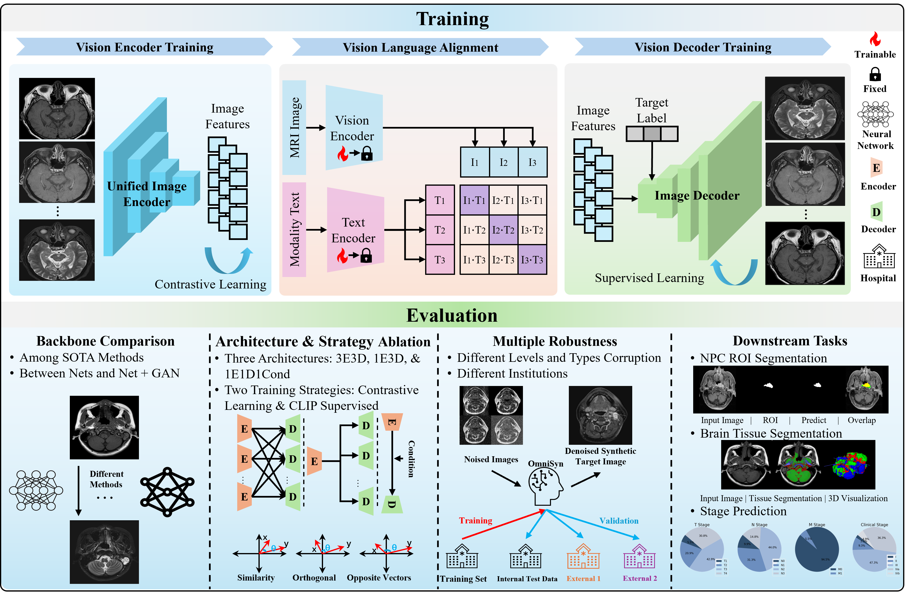
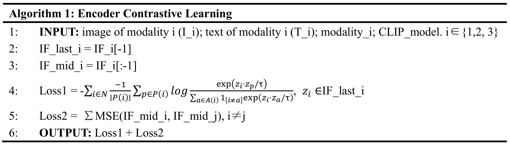
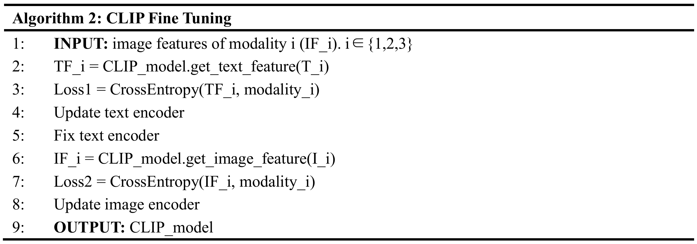
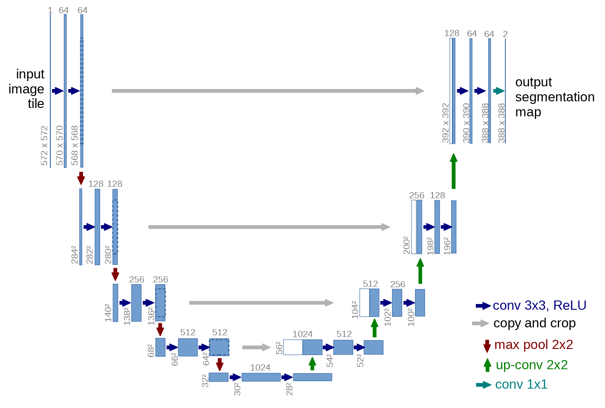
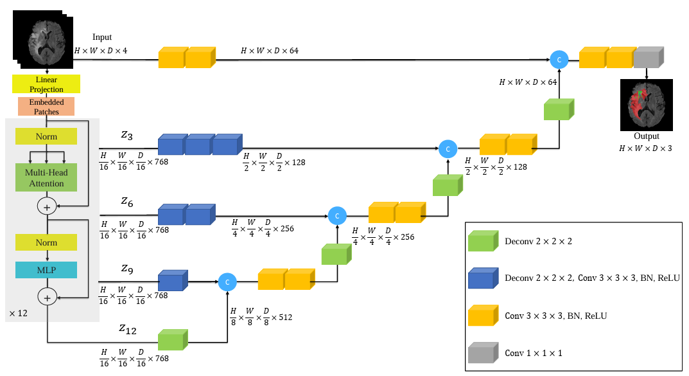
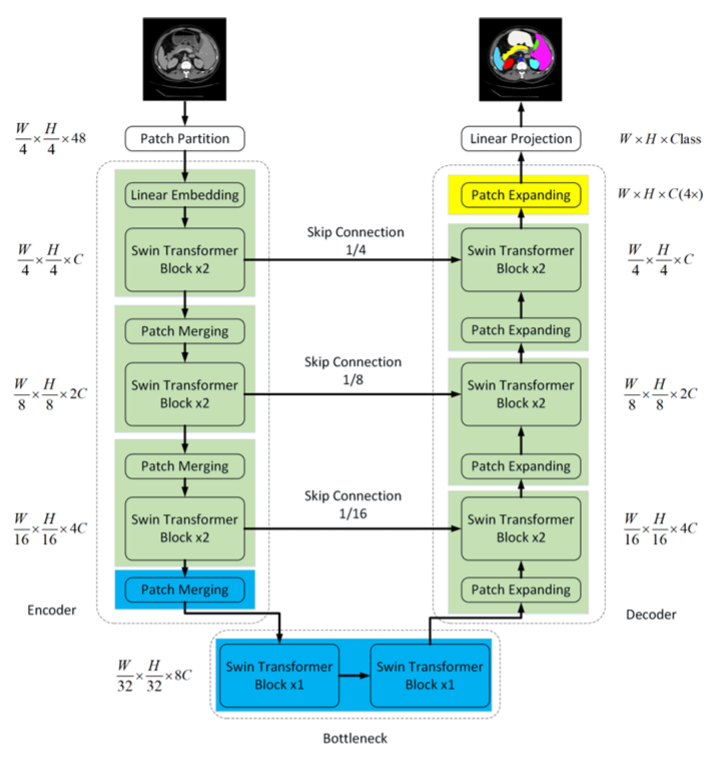
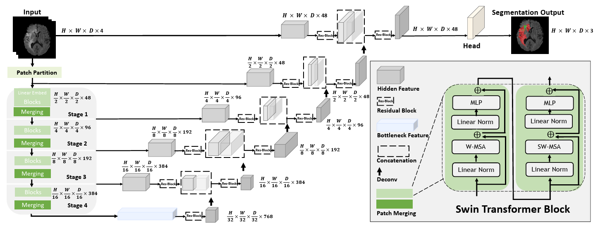
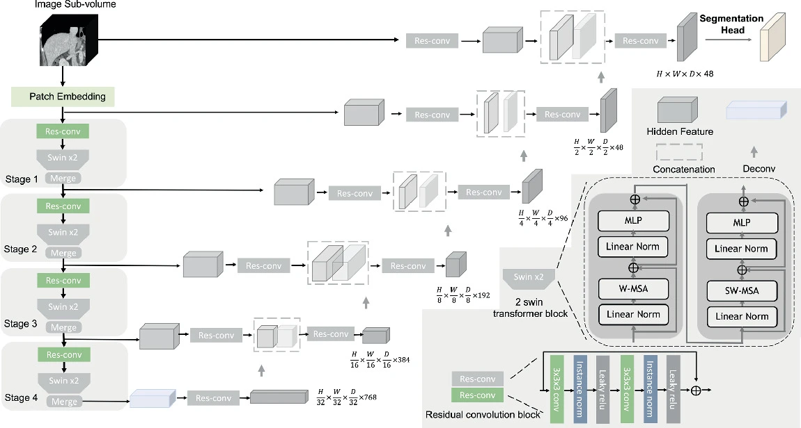
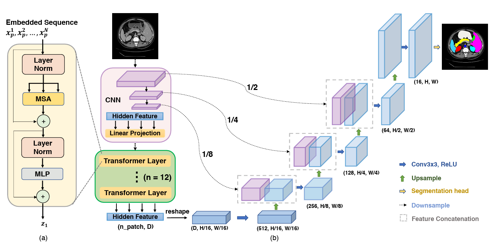
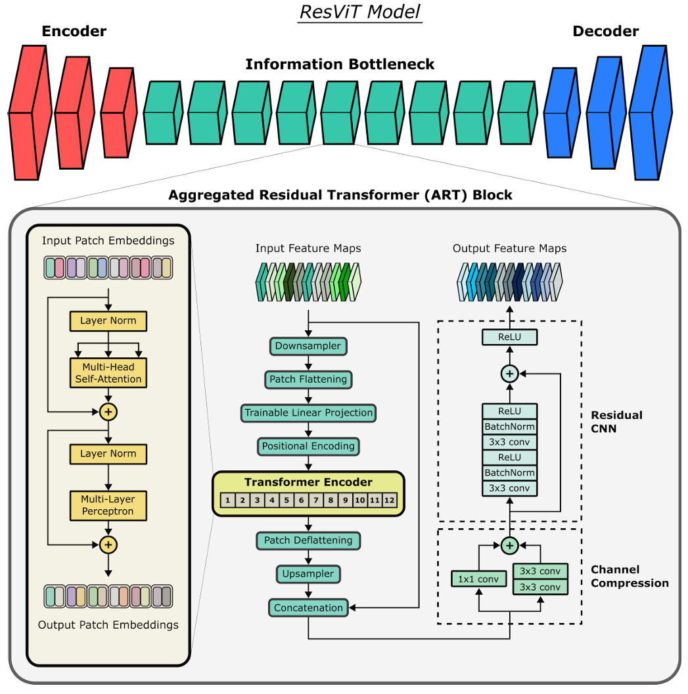

# OmniSyn

Welcome! :wave: This is the implementation of **OmniSyn**, a foundation model for any-to-all Nasopharyngeal Carcinoma (NPC) MRI synthesis. Ctrastive Learning, CLIP, Supervised Learning are adopted to synthesize any specified modality of MRI images. Trained on 40,825 images from 13 institutions, it achieves consistently high performance (average SSIM 0.90, PSNR 27) across 26 internal/external validation sites (15,748 images), with superior synthesis fidelity and robustness to noise and domain shifts. Meanwhile, its unified representation enhances downstream RT-relevant tasks (e.g., ROI segmentation, stage prediction).

## Framework



Algrithm1:



Algrithm2:



## Quick Start

1. Contrastive learning for Vision Encoder

```py
python 01trainencoder.py
```

2. CLIP alignment between image and clinical text

run `02clipnpc.ipynb` line by line.

3. MSE + CLIP supervision learning for Vision Decoder

```py
python 03traindecoder.py
```

## Public Dataset

External 2 test dataset: https://zenodo.org/records/13131827

Li, Y., Chen, Q., Li, M. et al. A dataset of primary nasopharyngeal carcinoma MRI with multi-modalities segmentation. Sci Data 12, 1450 (2025). https://doi.org/10.1038/s41597-025-05815-x


## Related Works

| Model Name | Architecture Overview | Description |
|------------|-----------------------|-------------|
| UNet       |  | Paper: https://arxiv.org/abs/1505.04597 <br> Arch: CNN Encoder-Decoder + Skip Connections |
| UNetr      |  | Paper: https://arxiv.org/abs/2103.10504 <br> Code: https://github.com/cameron-cs/unetr-brain-tumour-segmentation/blob/main/model/unetr2d.py <br> Arch: Transformer Encoder (ViT) + CNN Decoder + Residual Skip Connections |
| SwinUNet   |  | Paper: https://arxiv.org/abs/2105.05537 <br> Code: https://github.com/HuCaoFighting/Swin-Unet/blob/main/networks/swin_transformer_unet_skip_expand_decoder_sys.py <br> Arch: Swin Transformer Encoder + Swin Transformer Decoder + Skip Connections |
| SwinUNetr  |  | Paper: https://arxiv.org/abs/2201.01266 <br> Code: https://github.com/Project-MONAI/MONAI/blob/dev/monai/networks/nets/swin_unetr.py <br> Arch: Swin Transformer Encoder + CNN Decoder + Residual Skip Connections |
| SwinUNetrv2|  | Paper: https://link.springer.com/chapter/10.1007/978-3-031-43901-8_40  <br> Code: https://github.com/Project-MONAI/MONAI/blob/dev/monai/networks/nets/swin_unetr.py `use_v2=True` <br> Arch: Residual CNN + Swin Transformer Encoder + CNN Decoder + Residual Skip Connections |
| TransUNet  |  | Paper: https://arxiv.org/abs/2102.04306 <br> Code: https://github.com/mkara44/transunet_pytorch/blob/main/utils/transunet.py <br> Arch: CNN Encoder + Transformer (ViT) + CNN Decoder + Skip Connections |
| ResViT     |  | Paper: https://arxiv.org/abs/2106.16031 <br> Code: https://github.com/icon-lab/ResViT/blob/main/models/residual_transformers.py <br> Arch: CNN Encoder + Modified Transformer + CNN Decoder + Skip Connections |
| BrainMVP     |  | Paper: https://arxiv.org/abs/2410.10604v1 <br> Code: https://github.com/shaohao011/BrainMVP <br> Arch: Cross-Modal Reconstruction + Modality-wise Data Distillation + Modality-aware Contrastive Learning + Distilled Modality Template for Downstream Tasks |
| TUMSyn     |  | Paper: https://arxiv.org/abs/2409.16818 <br> Code: https://github.com/Wangyulin-user/TUMSyn <br> Arch: CLIP guided + CNN Encoder + Impicit Function + MLP Decoder |

CLIP: https://github.com/openai/CLIP

MedCLIP: https://github.com/RyanWangZf/MedCLIP

RadCLIP: https://github.com/luzhixiu/RadCLIP

MediCLIP: https://github.com/cnulab/MediCLIP

FSL: https://fsl.fmrib.ox.ac.uk/fsl/docs/index.html

SynthSeg: https://github.com/BBillot/SynthSeg